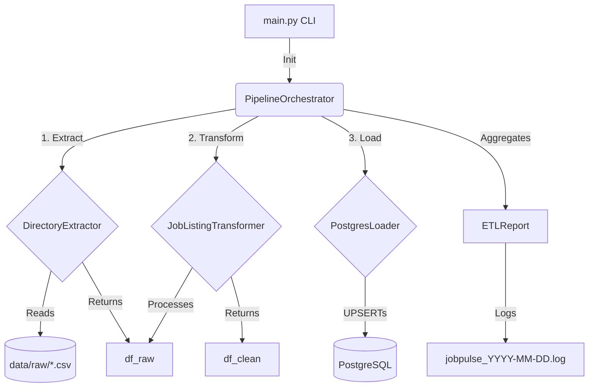

# JobPulse 📊

> **End-to-End Job Market Data Engineering Pipeline**

[](https://www.python.org/)
[](https://www.postgresql.org/)
[](LICENSE)
[](https://github.com/psf/black)

---

## Overview

**JobPulse** is a scalable, production-grade ETL (Extract, Transform, Load) pipeline
designed to ingest job market data from public datasets and APIs, clean and transform it,
store it in a PostgreSQL data warehouse, and surface it for SQL analytics and
Power BI dashboards.

This project follows industry best practices for Data Engineering, including modular
architecture, configuration management, structured logging, data validation, and
comprehensive testing.

---

## Architecture

```
Data Sources (APIs / CSVs / Datasets)
        │
        ▼
   [Extraction Layer]       ← src/extraction/
        │
        ▼
 [Transformation Layer]     ← src/transformation/
        │
        ▼
  [Validation Layer]        ← src/validation/
        │
        ▼
   [Loading Layer]          ← src/loading/
        │
        ▼
  PostgreSQL Data Warehouse  ← schema/ + src/database/
        │
        ▼
   Power BI Dashboards
```

> For detailed architecture diagrams, see `docs/architecture/`.

---

## Tech Stack

| Layer             | Technology                            |
|-------------------|---------------------------------------|
| Language          | Python 3.12                           |
| Database          | PostgreSQL 15+                        |
| ORM / DB Client   | SQLAlchemy 2.x                        |
| Data Processing   | Pandas 2.x                            |
| Orchestration     | Apache Airflow *(planned)*            |
| Dashboarding      | Power BI *(planned)*                  |
| Containerisation  | Docker *(planned)*                    |
| Cloud             | AWS (S3, RDS, MWAA) *(planned)*       |
| Version Control   | Git + GitHub                          |

---

## Project Structure

```
jobpulse/
├── config/                  # Configuration files (YAML, TOML)
├── data/
│   ├── raw/                 # Original, immutable source data
│   ├── staging/             # Intermediate/cleaned data
│   ├── processed/           # Final transformed data
│   └── archive/             # Archived/historical data
├── docs/
│   ├── architecture/        # Architecture decision records
│   ├── diagrams/            # System and data flow diagrams
│   └── decisions/           # ADR (Architecture Decision Records)
├── logs/                    # Application log files
├── sql/
│   ├── schema/              # DDL scripts (CREATE TABLE, etc.)
│   ├── queries/             # Analytical SQL queries
│   ├── views/               # SQL VIEW definitions
│   └── procedures/          # Stored procedures / functions
├── src/
│   └── jobpulse/
│       ├── config/          # Configuration loading & management
│       ├── database/        # DB engine, session management
│       ├── extraction/      # Data ingestion from sources
│       ├── loading/         # Data loading into PostgreSQL
│       ├── logging/         # Logging setup and handlers
│       ├── models/          # SQLAlchemy ORM models
│       ├── transformation/  # Data cleaning & transformation
│       ├── utils/           # Shared utility functions
│       └── validation/      # Data quality checks
├── tests/                   # Pytest test suite
├── .env.example             # Environment variable template
├── .gitignore               # Git ignore rules
├── LICENSE                  # MIT License
├── main.py                  # Pipeline entry point
├── pyproject.toml           # Build system & tool configuration
└── requirements.txt         # Python dependencies
```

---

## Quick Start

### Prerequisites

- Python 3.12+
- PostgreSQL 15+
- Git

### 1. Clone the Repository

```bash
git clone https://github.com/<your-username>/jobpulse.git
cd jobpulse
```

### 2. Create and Activate Virtual Environment

```bash
# Create virtual environment
python -m venv venv

# Activate (Windows)
venv\Scripts\activate

# Activate (Linux/macOS)
source venv/bin/activate
```

### 3. Install Dependencies

```bash
pip install -e ".[dev]"
```

### 4. Set Up Environment Variables

```bash
cp .env.example .env
# Edit .env with your actual credentials
```

### 5. Run the Pipeline

```bash
python main.py
```

---

## Configuration

All pipeline configuration is managed through:
- **`.env`** — Secrets and environment-specific values (never committed to Git)
- **`config/settings.yaml`** — Non-secret runtime configuration
- **`src/jobpulse/config/settings.py`** — Python configuration loader

See `.env.example` for all required environment variables.

---

## Extraction Workflow

The extraction layer (`src/jobpulse/extraction/`) is designed for robustness and scale:
- **BaseExtractor**: Defines the interface for all extractors (`validate_source`, `extract`).
- **CsvExtractor**: Reads individual CSVs using pandas. Features automatic encoding fallback (UTF-8 to Latin-1), memory-efficient chunked loading, whitespace normalization, and missing column detection.
- **DirectoryExtractor**: Ingests all CSV files within a directory (e.g., `data/raw/`). Features automatic schema alignment (strict, union, intersect), recursive scanning, and cross-file deduplication.
- **Resilience**: The extraction layer uses `tenacity` for automatic retry logic against transient file/OS errors and handles missing/empty data gracefully.

---

## Transformation Workflow

The transformation layer (`src/jobpulse/transformation/`) takes raw data from the extraction layer and standardises it for PostgreSQL loading. The process is vectorised using Pandas and is structured into a 15-step deterministic pipeline.

### Transformation Architecture
- **Fail Row, Not Pipeline**: Unrecoverable records (e.g., missing job titles) are flagged via `is_valid=False`, whereas recoverable parsing failures (e.g., weird salaries) receive `None` values and trigger quality flags instead of dropping the entire row.
- **Data Lineage**: Every transformed record preserves `source_file`, `source_system`, `extraction_timestamp`, and `transformation_timestamp`.
- **Performance**: Heavy operations (regex, parsing) are vectorised where possible, capable of processing hundreds of thousands of rows efficiently without excessive iterrow loops.

### Data Quality Rules
- **Quality Flags**: Features such as `is_valid`, `validation_errors`, `salary_parse_success`, and `location_parse_success` maintain data observability.
- **Deduplication**: In-memory deduplication based on `source_job_id` or (title, company, location) ensures unique records.
- **Sanity Bounds**: Salaries outside realistic boundaries (e.g., >$5,000,000) are flagged and suppressed to prevent analytical skews.

### Supported Formats
#### Salary Parsing
Supports all standard and international ranges, automatically calculating `salary_min`, `salary_max`, and `currency`:
- USD/GBP/EUR: `$120k`, `100000-140000 USD`, `£85000`
- INR: `₹12 LPA`, `₹12-18 LPA`, `12 Lakhs`, `20,00,000 INR`

#### Experience Parsing
Extracts `experience_min`, `experience_max`, and `experience_level_code`:
- Standard text: `Fresher`, `Entry Level`, `Junior`, `Associate`, `Mid Level`, `Senior`, `Lead`, `Principal`, `Architect`
- Ranges: `0-1 years`, `3 to 5 years`, `10+ years`

#### Skill Extraction
Automatically extracts overlapping skills from descriptions. The catalog includes:
`Python, SQL, PostgreSQL, MySQL, Oracle, MongoDB, Spark, PySpark, Kafka, Airflow, AWS, Azure, GCP, Snowflake, Databricks, dbt, Docker, Kubernetes, Power BI, Tableau, Git, GitHub, Linux, Pandas, NumPy, Hadoop, Hive, Delta Lake`

### Transformation Report Example
At the conclusion of a pipeline run, a `TransformationReport` object is yielded containing vital SLA metrics:
```python
{
    "rows_received": 10000,
    "rows_processed": 10000,
    "rows_removed": 0,
    "duplicate_rows_removed": 45,
    "invalid_salary_rows": 120,
    "missing_required_fields": 5,
    "processing_time_seconds": 2.45,
    "success_rate": 100.0
}
```

---

## Loading Workflow

The loading layer (`src/jobpulse/loading/`) ensures scalable, idempotent data ingestion into the PostgreSQL data warehouse using SQLAlchemy 2.x and `tenacity` for resilient retries.

### Loading Architecture & UPSERT Strategy
- **BaseLoader Interface:** Enforces chunking, validation, and generation of a `LoadReport`.
- **PostgreSQL Loader:** Uses `INSERT ... ON CONFLICT (source_job_id, data_source_id) DO UPDATE` to gracefully handle existing records.
- **Mutable vs Immutable Data:** UPSERT only updates mutable dimensions (e.g. `job_title`, `salary_max`, `is_remote`) while preserving source provenance (e.g. `data_source_id`, `job_id`).
- **Dynamic Lookup:** Automatically resolves `source_system` string labels to `data_source_id` foreign keys with an in-memory cache, dynamically registering new data sources into the catalog if not present.

### Transaction Flow & Recovery Strategy
- **Batching:** Default chunk size is 1000 rows. Memory-efficient implementation capable of processing >1M rows without overwhelming the database.
- **Atomic Commits:** Each chunk executes inside its own SQLAlchemy transaction context block (`session.begin()`).
- **Partial Recovery:** Failure of one batch triggers a rollback for *only that batch*, allowing the rest of the file to continue processing smoothly.

### Resilience & Incremental Loading
- **Tenacity Retries:** Transient DB faults (e.g., deadlocks, `OperationalError`, connection drops) trigger exponential backoff retries. Constraint violations (`IntegrityError`) fail fast.
- **Pipeline Runs Table:** Automatically maintains audit state (`RUNNING`, `SUCCESS`, `FAILED`, `PARTIAL`) in the `pipeline_runs` tracking table.

### Load Report Example
At the end of the load, a `LoadReport` is returned with detailed execution metrics:
```python
{
    "table_name": "jobs",
    "strategy": "upsert",
    "rows_received": 1000,
    "rows_inserted": 0,
    "rows_updated": 1000,
    "rows_failed": 0,
    "batches_processed": 1,
    "database_retry_count": 0,
    "execution_time": 0.435,
    "success_rate": 100.0
}
```

---
## Testing

```bash
# Run all tests
pytest

# Run with coverage report
pytest --cov=src/jobpulse --cov-report=html

# Run a specific test module
pytest tests/test_extraction.py -v
```

---

## Contributing

1. Create a feature branch: `git checkout -b feature/your-feature-name`
2. Commit changes: `git commit -m "feat: add your feature description"`
3. Push to branch: `git push origin feature/your-feature-name`
4. Open a Pull Request

Follow [Conventional Commits](https://www.conventionalcommits.org/) for commit messages.

---

## Architecture & Execution Flow
The `PipelineOrchestrator` unifies the ETL stages, controlling state, propagating errors, and generating an aggregated `ETLReport`. 



---

## CLI Usage

Run the complete pipeline end-to-end:
```bash
python main.py --full
```

### Exit Codes
- `0` - SUCCESS
- `1` - FAILURE (Extraction or Transformation crashed)
- `2` - PARTIAL SUCCESS (Loading completed but some batches failed)

---

## Sample ETL Report

At the end of a successful run, the console outputs:

```text
========================================
JobPulse ETL Summary
========================================

Files Processed      : 2
Rows Extracted       : 1,432
Rows Transformed     : 1,421
Rows Loaded          : 1,421
Rows Updated         : 104
Duplicates Removed   : 11
Rejected Rows        : 0

Pipeline Duration    : 2.3 seconds

Database             : PostgreSQL

Status               : SUCCESS
========================================
```

---

## Troubleshooting

- **`Database connection test FAILED`**: Ensure PostgreSQL is running and `DATABASE_URL` in `.env` is correct.
- **`Extraction failed: No data`**: Ensure `.csv` files exist in the `data/raw/` directory.
- **`ImportError`**: Ensure you are running Python from the root directory or have activated the `.venv`.

---

## Known Limitations

- **Memory Constraints**: The pipeline currently processes DataFrames in-memory. Very large datasets (> 10 million rows) might require increased RAM or migrating to an out-of-core solution like PySpark or Dask.
- **Isolated CLI Modes**: Flags like `--extract-only`, `--transform-only`, and `--load-only` are currently placeholders and explicitly throw a `NotImplementedError` to protect pipeline integrity.
- **Database Dependency**: The loader specifically utilizes PostgreSQL's `ON CONFLICT DO UPDATE`. Other SQL dialects are not currently supported.

---

## Future Roadmap

- [ ] **Validation Layer**: Implement Great Expectations data quality rules.
- [ ] **Intermediate Staging**: Persist `df_raw` and `df_clean` to disk (Parquet) to support isolated pipeline stages (`--load-only`).
- [ ] **Orchestration**: Wrap `main.py` execution within Apache Airflow DAGs.
- [ ] **Dashboards**: Serve analytics directly to Power BI.

---

## License

This project is licensed under the MIT License — see [LICENSE](LICENSE) for details.

---

## Author

**P Yogesh Yadav**
Author

P Yogesh Yadav
Electronics & Communication Engineering Student
Aspiring Data Engineer — JobPulse Project

---

## Validation Layer Architecture

The JobPulse pipeline is secured by a robust, native Pandas data validation framework (Phase 8) designed to "Fail the row, not the pipeline".

### Validation Flow
Extract -> Transform -> VALIDATE -> Load Operational Database -> Warehouse ELT -> Power BI

- **CRITICAL Rules**: Stop the pipeline immediately (e.g., Schema changes).
- **ERROR Rules**: Mark is_valid = False and filter the row out (e.g., Missing job title, Duplicates).
- **WARNING Rules**: Mark the row internally but load it (e.g., Suspicious salary bounds, unknown skills).

### Rule Registry & Adding Rules
The engine uses a dynamic @RuleRegistry.register pattern.
To add a new rule, inherit from BaseValidationRule and register it.

### Configuration
All rules are configurable in src/jobpulse/validation/config.py, allowing you to toggle severity dynamically without altering business logic.

### Reporting
Validation yields:
- A ValidationReport dataclass embedded inside the ETLReport.
- A polished HTML file generated to 
eports/validation_report.html.
- Historical trend logging to data/validation_history.csv.

---

## Phase 9: Apache Airflow Orchestration

JobPulse uses Apache Airflow as its official production orchestrator. The Airflow cluster runs via docker-compose and leverages a CeleryExecutor backed by Redis and PostgreSQL to execute DAGs at scale.

### Architecture Diagram
*(Placeholder for Architecture Diagram image)*


### Airflow DAG Diagram
*(Placeholder for Airflow DAG Screenshot)*


### Deployment Steps
1. Navigate to the project root: cd jobpulse
2. Initialize Airflow metadata (first run only):
   `ash
   docker-compose up airflow-init
   `
3. Start the entire cluster:
   `ash
   docker-compose up -d
   `
4. Access the UI at http://localhost:8080.

### Scheduler Configuration
Settings such as retries, timeouts, and notification lists are decoupled from DAG code. 
They can be configured via environment variables mapped in src/jobpulse/airflow/config.py:
- AIRFLOW_TASK_RETRIES=2
- AIRFLOW_RETRY_DELAY_MIN=5
- AIRFLOW_EXECUTION_TIMEOUT_MIN=30

### Troubleshooting
- **Task Stuck in Queued**: Ensure the  irflow-worker and edis containers are running.
- **Import Errors**: Verify that ./src is properly volume-mounted to /opt/airflow/src inside the docker-compose.yml.
- **Database Connection**: Check `airflow-init` logs. The metadata database is hosted in the postgres container.

---

## Phase 10: Streamlit Enterprise Frontend (Dashboard)

JobPulse features a complete FAANG-level frontend built with Streamlit, Plotly, and AG Grid. The application leverages a strict Service-Oriented Architecture (SOA) and connects to the existing PostgreSQL backend and ETL pipeline.

### Key Features
- **Dark Glassmorphism UI:** Custom CSS overrides standard Streamlit styling.
- **Animated Dashboards:** KPIs and metrics via Plotly.
- **SQL Playground:** Safe, read-only querying of the warehouse (`SELECT`, `WITH`, `EXPLAIN`).
- **Interactive Data Explorer:** AG Grid tables for live jobs and warehouse dimensions.
- **Pipeline Trigger:** Execute the `PipelineOrchestrator` dynamically from the browser.

### Running the Application

1. Ensure the database is running and all dependencies are installed:
   ```bash
   pip install -e ".[frontend]"
   ```
2. Launch the Streamlit server:
   ```bash
   streamlit run app.py
   ```
3. Open `http://localhost:8501` in your browser.
4. **Login:** Use `Demo Login (Admin)` for immediate access.
```
