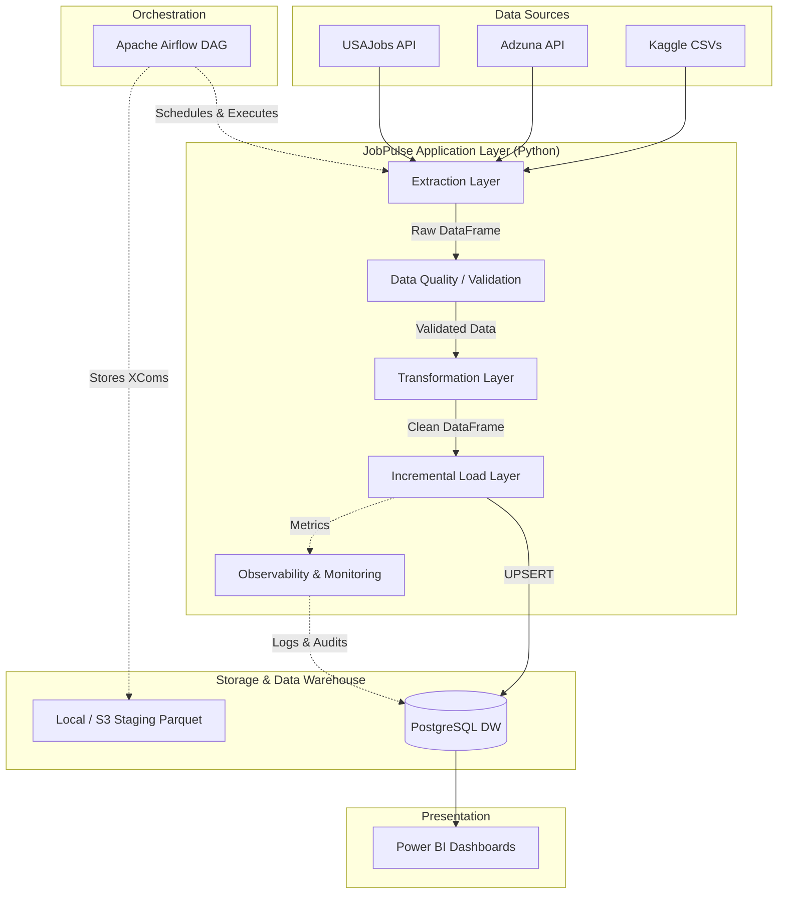

# JobPulse Architecture

JobPulse is an end-to-end Data Engineering Platform designed to ingest, process, and analyze job market data at scale.

## High-Level Architecture

The platform follows a modular, decoupled architecture centered around a central Data Warehouse (PostgreSQL) and orchestrated by Apache Airflow.

## Core Components

### 1. Data Pipeline (Python)
- **Extraction**: Object-oriented Extractors (`CsvExtractor`, `ApiExtractor`) pull data into Pandas DataFrames.
- **Transformation**: Data cleaning, schema enforcement, standardisation, and missing-value handling.
- **Loading**: An advanced `IncrementalRunner` that uses SHA-256 content hashing and watermarks to perform idempotent `UPSERT` operations, drastically reducing database I/O by skipping unchanged records.

### 2. Orchestration (Apache Airflow)
- Manages dependencies, retries, exponential backoff, and scheduling.
- Parallel execution across multiple data sources.
- Uses Parquet staging files for inter-task data transfer instead of overloading XComs.

### 3. Data Warehouse (PostgreSQL)
- Relational schema optimized for OLAP patterns.
- Includes `jobs`, `companies`, `locations`, `data_sources`, and observability tables (`pipeline_runs`, `pipeline_errors`).
- Stores `etl_watermarks` and `job_content_hashes` for incremental loading.

### 4. Observability & Data Quality
- **Data Quality Framework**: Runs validations pre- and post-transformation, dropping bad rows instead of crashing the pipeline ("fail row, not pipeline").
- **Observability**: `PipelineMonitor` tracks row counts, execution durations, and generates Prometheus-ready metrics. Logs are captured via structured JSON.

## Design Principles
- **Idempotency**: Any pipeline run can be safely re-executed without data duplication.
- **SOLID Object-Oriented Design**: High cohesion, loose coupling.
- **Fail Gracefully**: Bad data is quarantined; API failures trigger exponential backoff.
