# Database Design

JobPulse uses PostgreSQL as its central Data Warehouse. The schema is designed for both robust ETL ingestion and fast analytical queries (BI dashboards).

## Entity Relationship Diagram (ERD)

```mermaid
erDiagram
    data_sources ||--o{ jobs : "provides"
    companies ||--o{ jobs : "posts"
    locations ||--o{ jobs : "located at"
    pipeline_runs ||--o{ jobs : "loads"

    jobs {
        bigserial job_id PK
        text source_job_id
        integer data_source_id FK
        integer company_id FK
        integer location_id FK
        text job_title
        text employment_type
        numeric salary_min
        numeric salary_max
        text salary_currency
        boolean is_remote
        text description
        timestamp posted_date
    }

    companies {
        serial company_id PK
        text company_name
        text industry
    }

    locations {
        serial location_id PK
        text city
        text state
        text country
        text location_raw
    }

    data_sources {
        serial data_source_id PK
        text source_name
    }

    pipeline_runs {
        serial run_id PK
        text status
        timestamp started_at
        timestamp completed_at
    }

    etl_watermarks {
        text source_name PK
        timestamp last_successful_run_at
        integer late_arrival_buffer_hours
    }

    job_content_hashes {
        text source_job_id PK
        text source_name PK
        text content_hash
    }
```

## Schema Details

### Core Business Tables
- **`jobs`**: The central fact table containing job postings. Uses a composite unique constraint `(source_job_id, data_source_id)` to handle UPSERTs.
- **`companies`** & **`locations`**: Dimension tables to normalise text values and support efficient BI aggregations.

### Incremental ETL Tables
- **`etl_watermarks`**: Stores the high-water mark (timestamp of last successful run) for each source.
- **`etl_watermark_history`**: Append-only log of watermark advancements, allowing for historical pipeline rollbacks.
- **`job_content_hashes`**: Stores SHA-256 fingerprints of canonical job content to detect true row updates versus identical re-deliveries.

### Observability Tables
- **`pipeline_runs`**: Records execution metadata (rows extracted, loaded, skipped, duration).
- **`pipeline_errors`**: Detailed logs of any exceptions or data quality failures encountered during a run.

## Indexing Strategy
- Primary Keys on all tables.
- B-Tree indexes on foreign keys (`company_id`, `location_id`) for fast joins.
- Indexes on `posted_date` and `job_title` to support standard BI filtering.
- Composite index on `job_content_hashes (source_name, source_job_id)` for extremely fast bulk hash lookups during incremental detection.
